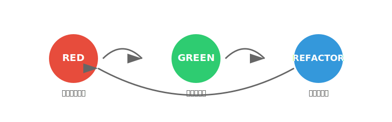
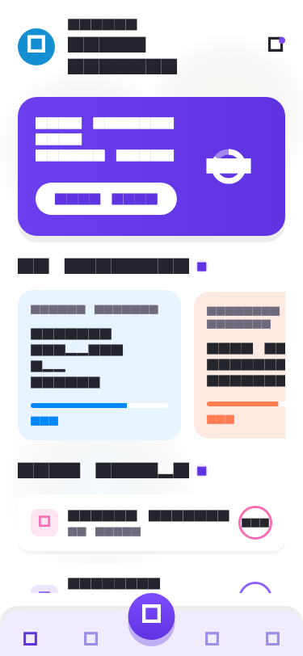
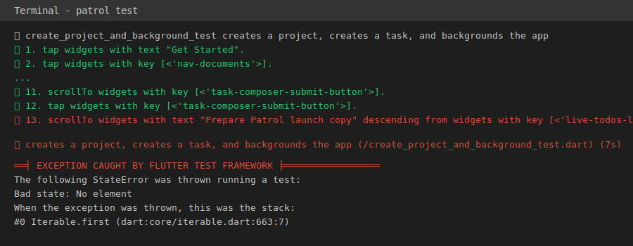
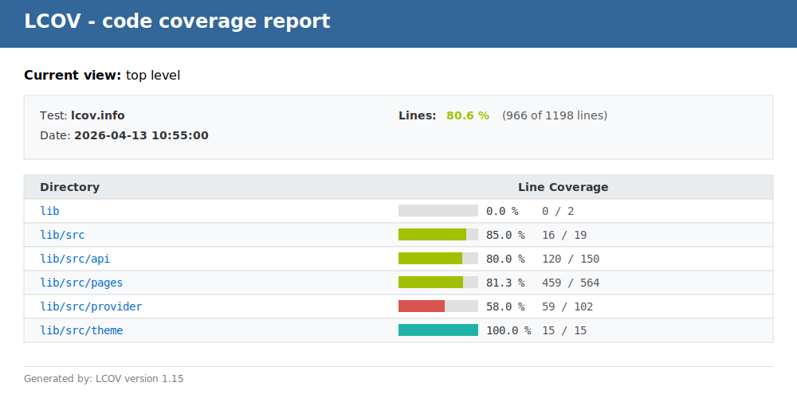
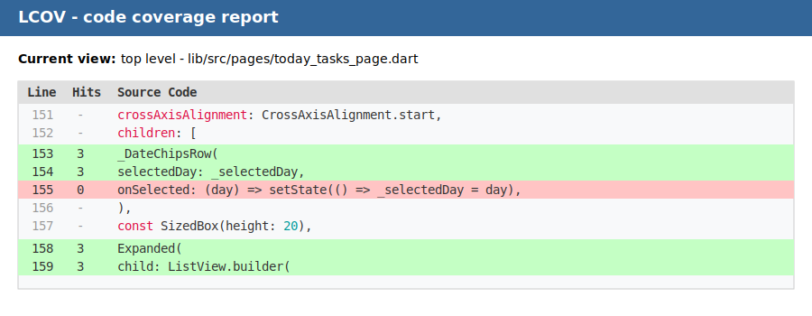
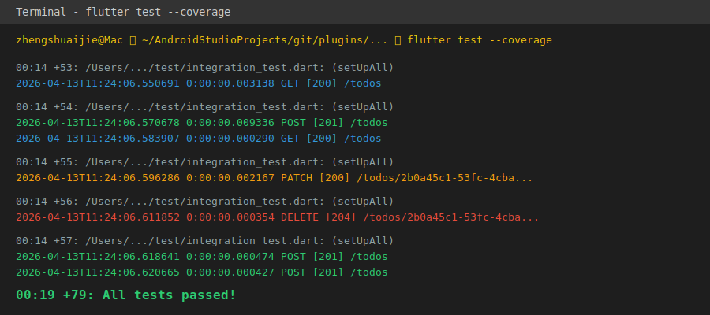

# 软件工程实践：基于 TDD 与大模型辅助的 Flutter 研发模式探索

探讨研发效率与代码质量的平衡，一直是我们关注的核心课题。传统的开发模式常常让我们面临这样一个困境：如何在快速交付功能的同时，确保系统的稳定性和可维护性？

## 一、 引言：我们面临的工程化挑战

在传统的开发迭代中，我们往往面临以下软件工程挑战：
1. **质量保障后置（Regression Prevention）**：“先开发，后测试”的模式容易在项目后期堆积大量的技术债。当需求频繁变更时，测试用例的编写往往被边缘化。
2. **回归测试成本高昂**：修复一个已知的缺陷，极易引入未知的隐患。由于缺乏底层的测试保护，QA 团队的回归测试负担极重。
3. **架构演进受阻**：面对复杂的历史代码（Legacy Code），由于缺乏安全网，开发者往往对重构望而却步，导致代码结构持续劣化。

那么，我们能否在编写代码的初期，就建立起一套健壮的自动化防护网？本文将结合近期「语音看板 (Voice Kanban)」模块的真实开发过程，复盘一次完整的 TDD（测试驱动开发）与 AI 大模型结对编程的落地实践。

---

## 二、 认知升级：测试金字塔与我们的测试结构

在讲 TDD 之前，必须先解决一个核心问题：**“是不是每个按钮、每行代码都要写测试？”**
答案是：绝对不是。盲目追求 100% 覆盖率只会拖垮团队。我们需要引入**“测试金字塔”**原理。

### 1. 警惕“冰激凌蛋筒”反模式
很多团队一搞测试，就喜欢搞 UI 自动化（E2E测试），底层单元测试几乎没有。这就形成了一个头重脚轻的“冰激凌蛋筒”。后果是：测试跑得极慢，UI 稍微改个边距测试就挂，维护成本极高，最后大家都不愿意跑测试了。

> *(👉 演示提示：展示反模式：倒立的金字塔 / 冰激凌蛋筒)*
> 

### 2. 稳固的测试金字塔
科学的测试结构应该是一个正金字塔：

> *(👉 演示提示：展示正规的测试金字塔图片)*
> 

*   **底座（单元测试 Unit Tests）**：数量最多，跑得极快（毫秒级）。只测核心业务逻辑、工具类、数据解析。**（ROI 极高）**
*   **中部（组件/集成测试 Widget/Integration Tests）**：数量适中。在我们的 Flutter 项目中，主要测 Riverpod 的 Provider 状态流转、复杂交互 Widget。不测颜色对不对，只测点下去后状态变没变。
*   **塔尖（端到端测试 E2E Tests）**：数量最少，跑得慢。只覆盖最核心的用户旅程（比如：打开APP -> 录音 -> 翻译成功）。

在「语音看板」的开发中，我们把 80% 的测试精力，投资在了金字塔的底座和中部。

---

## 三、 重新认识 TDD：核心理念与执行流程

什么是 TDD？很多人觉得它是“测试方法”，其实大错特错。**TDD 其实是 Test-Driven Design（测试驱动设计）**。

它逼着你在写业务代码前，先站在“调用者”的角度，思考这个类、这个 API 应该怎么设计才最顺手。就像我们在使用 Claude Code 的 `using-superpowers` 理念一样，TDD 的核心也是一种**系统化、有步骤的工程超能力**。

> *(👉 演示提示：展示 TDD 的核心循环图，这是全篇的灵魂所在)*
> 

它的核心心法只有三步（**Red-Green-Refactor**），这不仅是写代码的步骤，更是思维的执行流程：

1. 🔴 **红 (Red) - 明确目标，建立约束**
   *   **动作**：写一个必定失败的测试。
   *   **意义**：这一步甚至可能因为业务类不存在而导致编译报错。别慌，这是在强迫你**根据 PRD 或接口契约（Contract）来设计 API**，而不是根据实现来倒推 API。
   *   *（就像我们在开始一个开发任务前，必须先写好 Plan 明确目标一样。）*

2. 🟢 **绿 (Green) - 最小成本，解决问题**
   *   **动作**：用最快、最简单、甚至“最丑陋”的代码（比如直接返回写死的假数据），让测试通过。
   *   **意义**：只关注功能的实现，不纠结代码好不好看。当红灯变绿灯时，你获得了确定性：**这个功能在业务逻辑上跑通了**。

3. 🔵 **重构 (Refactor) - 追求卓越，毫无压力**
   *   **动作**：在绿灯的保护下，优化代码结构，消除重复代码（DRY），提取方法，应用设计模式。
   *   **意义**：因为有前面的绿灯保驾护航，你可以**毫无心理负担地大刀阔斧修改代码**。只要每次保存后测试依然是绿灯，就说明你没有破坏原有逻辑。这是消除“重构恐惧症”的终极武器。

---

## 四、 核心实战：四维测试体系的构建

void main() {
  group('TaskParser (函数测试)', () {
    
    test('应该将包含"紧急"的语音解析为高优先级任务', () {
      // 1. Arrange (准备数据)
      const voiceText = "帮我建一个紧急的会议任务";
      
      // 2. Act (执行函数)
      final task = TaskParser.parseVoiceToTask(voiceText);
      
      // 3. Assert (断言验证)
      expect(task.title, "帮我建一个开会任务");
      expect(task.priority, TaskPriority.high, reason: '包含"紧急"关键字应为高优先级');
      expect(task.status, TaskStatus.todo);
    });

    test('当语音内容为空时，应抛出异常', () {
      expect(
        () => TaskParser.parseVoiceToTask(""),
        throwsA(isA<ArgumentError>()),
        reason: '空字符串应该触发参数异常',
      );
    });
    
  });
}
```

### 2. Widget Test (组件/交互测试)
**🎯 目标**：测试独立 UI 组件的**渲染**和**交互逻辑**。不需要真机，在内存中模拟渲染，速度极快。（金字塔中部）
**📝 场景**：渲染一个 `TaskCardWidget`，验证其文本是否正确显示，并模拟用户点击“完成”复选框，验证回调是否触发。

```dart
// test/widgets/task_card_widget_test.dart
import 'package:flutter/material.dart';
import 'package:flutter_test/flutter_test.dart';

void main() {
  testWidgets('TaskCardWidget 渲染正确并能响应点击事件 (Widget 测试)', (WidgetTester tester) async {
    // 1. Arrange: 准备被测 Widget，并注入一个 Mock 的回调函数
    bool isCompletedClicked = false;
    final testTask = Task(title: '复盘 TDD 分享', isDone: false);

    await tester.pumpWidget(
      MaterialApp(
        home: Scaffold(
          body: TaskCardWidget(
            task: testTask,
            onCompleteTapped: () => isCompletedClicked = true,
          ),
        ),
      ),
    );

    // 2. Assert (初始渲染): 验证界面上有这个标题，且 Checkbox 处于未选中状态
    expect(find.text('复盘 TDD 分享'), findsOneWidget);
    
    final checkboxFinder = find.byType(Checkbox);
    expect(tester.widget<Checkbox>(checkboxFinder).value, false);

    // 3. Act (交互): 模拟用户点击了 Checkbox
    await tester.tap(checkboxFinder);
    await tester.pumpAndSettle(); // 等待动画或状态更新完成

    // 4. Assert (交互后验证): 验证我们的回调函数成功被触发
    expect(isCompletedClicked, true, reason: '点击 Checkbox 后应触发 onCompleteTapped 回调');
  });
}
```

### 3. Golden Test (视觉快照测试)
**🎯 目标**：UI 防退化神器！对组件进行“像素级”截图比对，防止公共样式变更导致 UI 跑偏。

> *(👉 演示提示：这是我们项目中真实的 Golden 文件，它将被用作每次提交的基准比对)*
> 

当组件样式发生意外偏移时，测试流水线会立即抛出异常并生成差异比对图（Diff）


**场景**：固化组件在不同生命周期状态下的视觉呈现。

```dart
// test/widgets/task_card_golden_test.dart
import 'package:flutter/material.dart';
import 'package:flutter_test/flutter_test.dart';

void main() {
  testWidgets('TaskCardWidget 视觉快照对比 (Golden 测试)', (WidgetTester tester) async {
    // 准备不同状态的数据
    final todoTask = Task(title: '普通任务', isDone: false);
    final doneTask = Task(title: '已完成任务', isDone: true);

    // 渲染到一个具有固定尺寸的容器中（保证截图尺寸一致）
    await tester.pumpWidget(
      MaterialApp(
        home: Scaffold(
          body: Column(
            children: [
              TaskCardWidget(task: todoTask, onCompleteTapped: () {}),
              TaskCardWidget(task: doneTask, onCompleteTapped: () {}),
            ],
          ),
        ),
      ),
    );

    await tester.pumpAndSettle();

    // 核心：将当前渲染的 UI 像素与本地的 'task_card_states.png' 进行对比
    // 首次运行需执行: flutter test --update-goldens
    await expectLater(
      find.byType(Column),
      matchesGoldenFile('goldens/task_card_states.png'),
    );
  });
}
```

### 4. Integration Test (集成/端到端测试) —— 引入 Patrol
**🎯 目标**：在真实的设备（真机或模拟器）上运行完整的 App，走完核心的用户旅程（E2E）。
**💡 痛点与破局**：原生的 `integration_test` 语法繁琐（一堆 `find.byKey` 和 `pumpAndSettle`），且**无法与 Native 弹窗交互**（如系统麦克风授权弹窗）。为此，我们引入了测试神器 **[Patrol](https://patrol.leancode.co/)**。
**📝 场景**：启动 App -> 解决系统权限弹窗 -> 触发添加任务 -> 验证新任务。

```dart
// integration_test/app_flow_test.dart
import 'package:flutter_test/flutter_test.dart';
import 'package:patrol/patrol.dart'; // 引入 Patrol
import 'package:my_app/main.dart' as app;

void main() {
  // patrolTest 完全替代了原生的 testWidgets
  patrolTest(
    '完整核心链路：使用 Patrol 玩转 E2E 与 Native 交互',
    ($) async { // $ 是 Patrol 提供的核心选择器，极大简化语法
      // 1. 启动整个 App
      await app.main();
      await $.pumpAndSettle();

      // 🌟 杀手锏 1：与操作系统的 Native UI 交互！
      // 模拟点击操作系统的"允许使用麦克风"权限弹窗 (原生测试做不到)
      if (await $.native.isPermissionDialogVisible()) {
        await $.native.grantPermissionWhenInUse(); 
      }

      // 🌟 杀手锏 2：极简语法的链式调用
      // 找到"语音添加"按钮并点击 (不再需要繁琐的 find.byKey)
      await $(#voice_add_fab).tap();

      // 输入文本并点击确认
      await $(#task_input_field).enterText("准备 TDD 分享的 PPT");
      await $('确认').tap(); // 直接通过文本内容查找

      // 5. 最终验证：首页的看板列表中，出现了刚刚添加的任务
      expect($('准备 TDD 分享的 PPT'), findsOneWidget);
    },
  );
}
```

> *(👉 演示提示：展示真实的 Patrol 运行日志。它的日志极其详尽，每一步 `✅` 和哪一步 `❌` 挂了清晰可见，一秒定位 E2E 问题)*
> 

---

## 五、 工程化落地与持续交付体系

写测试不是自嗨，必须融入团队的工程化流程中。这里简要分享一下我们在这个项目中是怎么落地的：

1. **测试工具链（从底层到 E2E 的全栈覆盖）**：
   *   **底层基建**：我们引入了 `flutter_test` 配合 `mockito`（或 `mocktail`），轻松搞定了底层的数据 Mock 和依赖注入。
   *   **UI 与集成利器：Patrol**：如前文演示，**Patrol 不仅能写端到端（E2E）测试，还能直接用于编写普通的 Widget Test！** 我们用一种极简的 `$()` 语法和一致的 API，统一了金字塔中部（Widget）和顶端（E2E）的测试写法，大幅降低了团队的学习成本。

2. **代码覆盖率可视化与下钻 (Coverage & HTML Report)**：
   *   **做法**：大家可以看看我们项目 README 里最近增加的覆盖率徽章（例如最近提交的 `chore:README 覆盖率徽章`）。我们通过一行命令跑出测试数据，并生成网页版报告：
   
   ```bash
   cd ..
   # 1. 运行全量测试并收集覆盖率数据
   flutter test --coverage
   
   # 2. 将原始的 lcov.info 转换为可视化的 HTML 网页
   genhtml coverage/lcov.info -o coverage/html
   
   # 3. 在浏览器中打开报告 (macOS)
   open coverage/html/index.html
   ```
   
   > *(👉 演示提示：可以在PPT中展示 HTML 报告主页的截图，突出整体覆盖率及各模块的占比)*
   > 

   *   **下钻到文件级覆盖率**：更重要的是，我们利用工具（`genhtml`）生成了详细的本地 HTML 报告。在浏览器里打开它 (`coverage/html/index.html`)，你不仅能看到全局 80.6% 的覆盖率，还能**像拿放大镜一样，一层层点进具体的 Dart 文件里**。哪一行代码被跑到了（绿色），哪一行 `if` 分支被漏掉了（红色），一目了然。
   
   > *(👉 演示提示：在这里截一张 HTML 报告里具体的代码页面图，展示红绿代码行的对比，效果极佳)*
   > 

   *   **收益**：覆盖率徽章不仅是给老板看的 KPI，更是让团队发版不手抖的定心丸；而微观的文件级 HTML 报告，则是指引我们去哪里补齐测试的活地图。

3. **测试运行与网络 Mock 可视化**：
   *   在我们使用 `flutter test` 运行集成测试时，由于我们结合了完善的 Mock 机制和日志打印，你可以清楚地在终端看到所有的请求。
   *   不仅包括 `GET` 获取列表，还有 `POST` 创建任务、`PATCH` 更新状态，甚至 `DELETE` 删除任务，它们的状态码（200、201、204）和耗时一目了然。测试不再是一个干瘪的“Passed”，而是一个有生命力的全链路体检报告。

   > *(👉 演示提示：这是我们项目中运行测试时的真实日志输出，展示了它强大的网络模拟与追踪能力)*
   > 

4. **CI/CD 护城河（如何防退化）**：
   *   **做法**：我们在本地配置了 Git Hooks（使用 `.husky`）。在我们的开发流程中，每次执行 `git commit` 时，底层会自动触发 `.husky/pre-commit` 钩子，执行 `flutter test` 命令运行全量测试。
   *   **收益**：把问题拦截在了**提交代码的第一步**！如果有任何一个测试挂了，代码根本就无法 Commit。这道护城河强制每个开发者对自己的代码质量负责，把烂代码死死挡在了仓库之外，让 `main` 分支永远处于可发布的安全状态。

---

## 六、 TDD 避坑指南与真实感受

实践下来，我想客观地分享几点真实感受，打破大家对 TDD 的偏见：

*   **误区 1：TDD 会拖慢开发速度吗？**
    *   **真相**：在头两天搭建基建、写 Mock 数据时，确实会觉得慢。但拉长到整个迭代来看，它消灭了 80% 的低级 Bug 和边界异常。**联调更顺畅，QA 回归极快，几乎没有返工。** 整体 ROI（投资回报率）是极高的。
*   **误区 2：什么都要 TDD 吗？**
    *   **真相**：千万别走火入魔！对于纯 UI 的拼接（画个圆角、调个边距），千万别 TDD，眼见为实即可。**好钢用在刀刃上**，只对复杂的状态流转、数据解析、核心算法进行 TDD。
*   **痛点**：前期思维转变最难（程序员总想上来就一把梭写实现），以及维护复杂 Mock 数据需要一定的成本。

---

## 六、 附录：AI 结对编程的真实演练（核心彩蛋）

作为 AI 辅助编程时代的开发者，在这期“语音看板”的开发中，我们深度结合了 **Claude Code CLI** 的能力来驱动 TDD。很多人怕 AI 乱写代码导致系统崩溃。但我们探索出了一套极具实战价值的**“AI + TDD 双向驱动”流程**。AI 负责快速写实现代码（当免费劳动力），而你负责用 TDD 画下护城河和防退化边界（当架构师）。

如果你好奇“究竟该怎么向 AI 下达 TDD 指令，它才不会瞎写代码？”
那么，这份从我的终端历史记录里挖出来的真实复盘（记录于 Session `7537d3...`），就是一份极佳的操作指南。

### 1. 核心破冰指令（只用了一句话）

在我完成需求拆解后，我在终端唤起了 Claude Code，然后敲下了这一句极其关键的命令：

```bash
> docs/plan 帮我实现除3.1的功能吧 /using-superpowers
```

这句话看似简单，但暗藏了 3 个高级工程技巧：
1. **指定上下文边界**：`docs/plan` 目录。这是我在这之前让 AI 结合 PRD 拆解出的严密的 TDD 测试清单（如 `client-voice-kanban-checklist.md`）。我直接告诉 AI：“别瞎猜，拿着这份需求和测试断言大纲来做”。
2. **划定作用域**：`帮我实现除3.1的功能吧`。明确这次迭代的 Scope，避免 AI 因为“太聪明”而去超纲开发。
3. **注入灵魂技能**：`/using-superpowers`。这是整个 TDD 得以成功执行的开关。它强制激活了项目配置中预设的开发纪律，最核心的约束就是：**“必须先写单元测试跑到报错（Red），再写业务代码（Green）”**。

### 2. Claude 是怎么执行这句指令的？

在接下来的半小时里，我的终端仿佛被一个严谨的高级测试工程师接管了。根据底层的执行日志，Claude 自动进行了以下疯狂但极其规范的闭环操作：

#### Step 2.1: 疯狂建文件与写测试（红灯阶段：它懂金字塔！）
它并没有一股脑只写一种测试，而是严格遵循了我们前面提到的“测试金字塔”结构。
*它写出了如下文件，**注意，这时候它还完全没有写任何业务代码（如 API 或 Provider）的实现***：
*   **【底层】Unit Test（业务逻辑）**：`WRITE: voice_kanban_model_test.dart`
    *(测试：模型序列化、`fromJson`/`toJson` 的边界条件、默认值解析)*
*   **【底层】Unit Test（网络请求）**：`WRITE: voice_kanban_api_client_test.dart`
    *(测试：Mock Dio 请求，断言发出的 POST `/parse` 和 `rawText` 正不正确，能否正确捕获服务端的 400 报错)*
*   **【中层】Widget Test / Provider Test（状态流转）**：`WRITE: voice_kanban_provider_test.dart`
    *(测试：调用 API 接口后，Riverpod 状态是否能从 `AsyncLoading` 流转到 `AsyncData`，草稿列表数据有没有对上)*
*   **【中层】Widget Test（组件渲染交互）**：`WRITE: voice_kanban_page_test.dart`
    *(测试：在内存里把看版页面渲染出来，模拟点击筛选“全部/Task/Note”芯片，断言列表能正确过滤，同时用 `matchesGoldenFile` 顺手生成了 UI 基准图（**Golden Test**）防止样式退化)*

*至于顶层的 **Integration Test（集成/E2E 测试）**，Claude 在那次狂奔的半小时 Session 中并没有写。它非常聪明地止步于此（这是极其符合金字塔原理的：不要过早介入极其脆弱的 UI 全链路测试）。直到后来底层全绿了，我才让它在 `integration_test/voice_kanban_test.dart` 里补齐了那条全局主流程 E2E 测试。由于底层稳固，这个集成测试几乎是**一次性写完、一把跑通的**！*

#### Step 2.2: 强行跑测试验证失败（见红）
在它写完这些测试代码后，它并没有“自作聪明”地马上补齐业务代码，而是非常老实地在后台自己执行了 `flutter test`，以便用报错来建立约束：
```bash
BASH TEST: flutter test test/voice_kanban_model_test.dart
BASH TEST: flutter test test/voice_kanban_api_client_test.dart
# （终端日志显示，这里抛出了一大堆类找不到的编译错误，因为实现类还没建，完全符合 TDD 的 Red 阶段）
```

#### Step 2.3: 补充最小实现与反复自愈（由红变绿）
确认了测试报错后，Claude 才开始去写对应的业务代码。

**最震撼的一幕出现了**：每写完一个类的初步实现，它就会自动在后台再去跑对应的 `flutter test`，用红绿状态来验证自己写的代码。
根据底层的 Bash 执行日志，在这个 Session 里，Claude 竟然**自主且密集地运行了三十多次 `flutter test`**，反复在“红 -> 绿”的泥潭里自我博弈和修复！

以下是我从历史记录里提取的一段极其真实的**“自我修复”死循环实录**（以 `voice_kanban_page_test.dart` 为例）：

1.  **第一次跑**：挂了（Red）。日志显示它捕获到了报错：`No ProviderScope found`。因为写 Widget 测试时忘记在最外层包上 Riverpod 环境了。于是它立刻去修改测试文件，把 `TaskCard` 包了起来。
2.  **第二次跑**：又挂了（Red）。报错变了：`Expected: exactly one matching node in the widget tree. Actual: _ZeroWidgetFinder`。它找不到测试代码里指定的那个包含“保存”文案的按钮！AI 去检查了一下自己刚才写的 UI 代码，发现里面没加 `Key('save_btn')`，于是马上打开业务代码补上了这行 Key。
3.  **第 N 次跑**：依然挂（Red）。这次是状态流转问题：模拟发送语音请求后，页面应该先出 `CircularProgressIndicator`（Loading）。但 AI 写的异步逻辑有问题，抛出了 `PumpAndSettle timed out`。它耐心地调整了测试代码里的 `tester.pump()` 机制。
4.  **最后一次跑**：终于，绿灯通过！（Green）✅ 确认绿灯后，它才停下来，并在终端里非常优雅地向我汇报。

### 3. 我的感受与结语

整个开发过程中，我除了敲下一开始的那句包含 `/using-superpowers` 的需求指令外，**仅仅是在它分批停下来询问时，敲了几次回车和 `继续`**。

剩下的所有体力活——设计测试断言、生成 Mock 数据、写出最初的业务代码、自己跑测试修复报错……全部由 Claude Code 根据 TDD 纪律全自动闭环完成了。

这就是在这个 AI 时代，作为一个开发者最极致的爽感：**用需求和契约（Plan/Checklist）作为紧箍咒，用 TDD 作为护城河，然后放手让 AI 在测试绿灯的保护下疯狂输出代码。**

---

## 七、 总结与行动呼吁

总结一下，测试金字塔指明了我们该测什么，TDD 提供了怎么测的方法论，而 AI 工具则为我们插上了提效的翅膀。**TDD 给开发者的最大礼物，不是一个不会报错的程序，而是面对祖传代码敢于重构的底气，以及周末不用带电脑回家的睡眠质量。**

**如何开始你的第一步？**
*   不要一上来就发誓要对整个项目进行 TDD。
*   下一次，当你遇到一个复杂的 Utils 工具类，或者发现了一个线上的 Bug 时，**试着先写一个能复现这个 Bug 的测试（让它亮红灯），然后再去修改代码修复它（亮绿灯）。**

只要体会过一次这种“绿灯亮起，万事大吉”的暗爽，你就会爱上这种开发方式。

谢谢大家！
